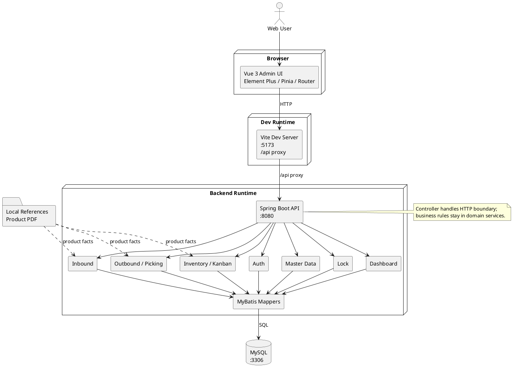

# Architecture Map

## Product Context

本项目是面向汽车企业供应链/仓储场景的 WMS 仓储管理系统训练项目，目标是围绕仓储效率和精细化管理逐步实现 Web 前端、服务器端以及后续可能的安卓手持扫码端协同。

产品背景资料显示的核心业务范围包括：

- 入库单制作、入库状态跟踪、唯一看板打印、手持扫码入库。
- 条码过程状态监控。
- 出库单、带单/不带单扫码出库。
- 转包、封存、解封、退库。
- 库存/看板监控、库位库存、高低储预警。
- 零件扫码防错、先进先出。
- 供应商、客户、零件、器具、仓库、库位等基础信息。
- 角色、权限、用户管理。

当前代码已覆盖 Web 端登录、入库、出库、锁货、库存、看板、基础数据和 Dashboard 等训练模块；安卓/PDA 原生端、MES/ERP/SAP 接口和正式权限体系尚未接入。

## Source Layout

```text
backend/
  pom.xml
  src/main/java/com/scut/wms/
    WmsApplication.java
    auth/              # 登录、当前用户、演示 token
    common/            # 通用业务异常等基础类型
    config/            # CORS、全局异常处理、数据迁移
    masterdata/        # 供应商、物料、仓库、库位
    container/         # 器具类型
    inbound/           # 入库单、看板生成、入库详情
    outbound/          # 出库单、出库详情、出库历史
    outbound/picking/  # 出库拣货
    lock/              # 锁货、解锁、重新分配、强制审计
    inventory/         # 扫码入库、库存余额、流水、看板追溯
    dashboard/         # 首页统计
  src/main/resources/
    mapper/            # MyBatis XML 查询
  src/test/java/com/scut/wms/

frontend/
  package.json
  vite.config.js
  src/
    api/               # axios 与各业务 API
    components/        # 菜单、标签栏等布局组件
    router/            # Vue Router 与登录守卫
    stores/            # Pinia auth/tabs 状态
    views/
      inbound/         # 入库页面
      outbound/        # 出库、锁货、拣货页面
      inventory/       # 库存页面
      kanban/          # 看板页面
      master-data/     # 基础数据页面
    menu.js            # 菜单与 WMS 模块元数据

docs/references/Course PPT/
  WMS仓储管理系统--产品介绍资料.pdf
```

## Architecture Diagram (Allocation + Development View)



## Runtime Shape

```text
Browser
  -> Vite dev server :5173
    -> /api proxy
      -> Spring Boot :8080
        -> MySQL :3306
```

当前前端通过 `vite.config.js` 将 `/api` 代理到 `http://localhost:8080`。后端暴露认证、入库、出库、锁货、库存、看板、基础数据和 Dashboard API；认证仍是演示账号和演示 token，不是正式权限体系。

## Dependency Direction

- 前端页面依赖 `frontend/src/menu.js` 的菜单元数据，不应在多个组件重复硬编码 WMS 模块列表。
- 前端 API 层经 `frontend/src/api/http.js` 统一设置 baseURL 和 token header。
- 后端 Controller 只处理 HTTP 边界，业务规则放在对应领域 Service。
- 业务模块按领域划分包；不要把新增业务塞进 `auth` 或 `config`。

## External Boundaries

- PDF 中提到 MES、ERP、SAP 等接口只是外部系统边界，不代表当前仓库已经接入。
- 安卓手持 app 是产品背景中的终端形态；当前仓库尚未出现安卓子项目。
- 数据库、真实权限、条码设备、接口协议均需要进入 spec 后再实现。
