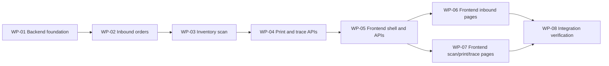

# Week 2 采购入库核心功能 Implementation Plan

> **For agentic workers:** REQUIRED SUB-SKILL: Use `superpowers:subagent-driven-development` (recommended) or `superpowers:executing-plans` to implement this plan task-by-task. Steps use checkbox (`- [ ]`) syntax for tracking.

**Goal:** Build the Week 2 WMS procurement inbound workflow with MySQL persistence: inbound orders, kanban labels, Web scan inbound, inventory balances, inventory trace, and kanban trace.

**Architecture:** Implement backend first around a stable 9-table MySQL model, then expose business APIs consumed by Vue pages. Keep business rules in Spring services, persistence in MyBatis-Plus mappers, complex trace queries in MyBatis XML, and frontend UI aligned with the existing Element Plus admin layout.

**Tech Stack:** Java 17, Spring Boot 3.3.5, MyBatis-Plus, MySQL 8, JUnit/Spring MVC tests, Vue 3, Vite, Element Plus, Pinia, Vue Router, Axios, Vitest.

---

## Execution Topology

Implementation uses separate worktrees per work package. Worktrees are created from the current `dev/iter2` integration branch and merged back into `dev/iter2` after review and verification.

| Work Package | Branch | Worktree | Dependencies | Scope |
| --- | --- | --- | --- | --- |
| WP-01 Backend foundation | `feature/week2-inbound-foundation` | `.worktrees/week2-inbound-foundation` | none | dependencies, datasource config, schema/data SQL, entities, mappers, master data options |
| WP-02 Inbound orders | `feature/week2-inbound-orders` | `.worktrees/week2-inbound-orders` | WP-01 | inbound order create/update/list/release/cancel and kanban generation |
| WP-03 Inventory scan | `feature/week2-inventory-scan` | `.worktrees/week2-inventory-scan` | WP-02 | scan-inbound transaction, inventory movement, inventory balance updates |
| WP-04 Print and trace APIs | `feature/week2-print-trace` | `.worktrees/week2-print-trace` | WP-03 | inbound print data, kanban print data, inventory trace, kanban trace |
| WP-05 Frontend shell and APIs | `feature/week2-inbound-frontend-shell` | `.worktrees/week2-inbound-frontend-shell` | WP-04 API contracts | menu, routes, frontend API wrappers |
| WP-06 Frontend inbound pages | `feature/week2-inbound-frontend-orders` | `.worktrees/week2-inbound-frontend-orders` | WP-05 | inbound order list and form views |
| WP-07 Frontend scan/print/trace pages | `feature/week2-inbound-frontend-trace` | `.worktrees/week2-inbound-frontend-trace` | WP-05 | scan inbound, print, inventory balance, inventory trace, kanban trace views |
| WP-08 Integration verification | `feature/week2-inbound-integration` | `.worktrees/week2-inbound-integration` | WP-01 through WP-07 | merge validation, full tests, manual demo notes, plan closeout |

Dependency graph:



Execution policy:

- Each work package is implemented by a fresh subagent in its assigned worktree.
- A package may start only after its dependencies have merged into `dev/iter2`.
- WP-06 and WP-07 may run in parallel after WP-05 because their view files are mostly disjoint.
- If a package reports dependency drift, stop that package, merge the missing dependency, rebase or recreate its worktree, then resume.
- Review gates per package: implementation self-check, spec compliance review, code quality review, merge to `dev/iter2`.

## Required Context

- Hard constraints: read `FORCE_CONSTRAIN.md` before implementation.
- Product design: `docs/specs/module-inbound-core-design.md`.
- Data model review: `docs/specs/module-inbound-data-model-review.md`.
- Current commands: `KEY_INFO_REMINDER.md`.
- Implementation branch: create a feature worktree from `dev/iter2`, for example `.worktrees/week2-inbound-core` on `feature/week2-inbound-core`.

## File Structure

Backend files to create or modify:

- Modify `backend/pom.xml`: add MyBatis-Plus, MySQL driver, and test database support if required.
- Create `backend/src/main/resources/application.yml`: datasource, SQL init, MyBatis mapper locations.
- Create `backend/src/main/resources/schema.sql`: 9-table MySQL schema.
- Create `backend/src/main/resources/data.sql`: deterministic demo master data and one demo inbound order.
- Create `backend/src/main/java/com/scut/wms/common/BusinessException.java`: domain error with HTTP status.
- Modify `backend/src/main/java/com/scut/wms/config/GlobalExceptionHandler.java`: map business errors to JSON.
- Create package `backend/src/main/java/com/scut/wms/masterdata/`: master data DTOs, mapper, service, controller.
- Create package `backend/src/main/java/com/scut/wms/inbound/`: inbound entities, DTOs, mapper, service, controller.
- Create package `backend/src/main/java/com/scut/wms/inventory/`: scan request/response, inventory DTOs, mapper, service, controller.
- Create `backend/src/main/resources/mapper/InboundMapper.xml` and `InventoryMapper.xml`: complex list, print, and trace queries.
- Create backend tests under `backend/src/test/java/com/scut/wms/inbound/` and `backend/src/test/java/com/scut/wms/inventory/`.

Frontend files to create or modify:

- Modify `frontend/src/menu.js`: add inbound scan, current inventory, inventory trace, and kanban trace menu entries.
- Modify `frontend/src/router/index.js`: route key-specific pages instead of routing every item to `PlaceholderPage`.
- Create `frontend/src/api/masterData.js`, `inbound.js`, `inventory.js`, `kanban.js`.
- Create `frontend/src/views/inbound/InboundOrderListView.vue`, `InboundOrderFormView.vue`, `InboundPrintView.vue`, `KanbanPrintView.vue`, `InboundScanView.vue`.
- Create `frontend/src/views/inventory/InventoryBalanceView.vue`, `InventoryTraceView.vue`.
- Create `frontend/src/views/kanban/KanbanTraceView.vue`.
- Create focused frontend tests for route wiring and scan behavior.

## Task 1: Backend Persistence Dependencies And Configuration

**Files:**
- Modify: `backend/pom.xml`
- Create: `backend/src/main/resources/application.yml`
- Test: `backend/src/test/java/com/scut/wms/WmsApplicationTest.java`

- [ ] **Step 1: Add dependencies**

Add MyBatis-Plus and MySQL dependencies to `backend/pom.xml`:

```xml
<dependency>
    <groupId>com.baomidou</groupId>
    <artifactId>mybatis-plus-spring-boot3-starter</artifactId>
    <version>3.5.9</version>
</dependency>
<dependency>
    <groupId>com.mysql</groupId>
    <artifactId>mysql-connector-j</artifactId>
    <scope>runtime</scope>
</dependency>
```

- [ ] **Step 2: Add datasource configuration**

Create `backend/src/main/resources/application.yml`:

```yaml
spring:
  datasource:
    url: jdbc:mysql://localhost:3306/scut_wms?useUnicode=true&characterEncoding=utf8&serverTimezone=Asia/Shanghai&allowPublicKeyRetrieval=true&useSSL=false
    username: root
    password: root
    driver-class-name: com.mysql.cj.jdbc.Driver
  sql:
    init:
      mode: always
      encoding: UTF-8
      schema-locations: classpath:schema.sql
      data-locations: classpath:data.sql

mybatis-plus:
  mapper-locations: classpath*:mapper/**/*.xml
  configuration:
    map-underscore-to-camel-case: true
```

- [ ] **Step 3: Run backend tests to expose missing schema**

Run: `cd backend && mvn test`

Expected before schema exists: application context may fail because `schema.sql` is missing. If it fails for missing resources, continue to Task 2.

- [ ] **Step 4: Commit**

```bash
git add backend/pom.xml backend/src/main/resources/application.yml
git commit -m "feat(inbound): 配置 MySQL 与 MyBatis-Plus"
```

## Task 2: Database Schema And Demo Data

**Files:**
- Create: `backend/src/main/resources/schema.sql`
- Create: `backend/src/main/resources/data.sql`
- Test: `backend/src/test/java/com/scut/wms/WmsApplicationTest.java`

- [ ] **Step 1: Create 9-table schema**

Create `schema.sql` with these table responsibilities:

```sql
DROP TABLE IF EXISTS inventory_balance;
DROP TABLE IF EXISTS inventory_movement;
DROP TABLE IF EXISTS kanban_board;
DROP TABLE IF EXISTS inbound_order_line;
DROP TABLE IF EXISTS inbound_order;
DROP TABLE IF EXISTS storage_location;
DROP TABLE IF EXISTS warehouse;
DROP TABLE IF EXISTS material;
DROP TABLE IF EXISTS supplier;

CREATE TABLE supplier (
  id BIGINT PRIMARY KEY AUTO_INCREMENT,
  supplier_code VARCHAR(64) NOT NULL UNIQUE,
  supplier_name VARCHAR(128) NOT NULL,
  contact_name VARCHAR(64),
  contact_phone VARCHAR(32),
  status VARCHAR(32) NOT NULL,
  created_at DATETIME NOT NULL DEFAULT CURRENT_TIMESTAMP,
  updated_at DATETIME NOT NULL DEFAULT CURRENT_TIMESTAMP ON UPDATE CURRENT_TIMESTAMP
);

CREATE TABLE material (
  id BIGINT PRIMARY KEY AUTO_INCREMENT,
  material_code VARCHAR(64) NOT NULL UNIQUE,
  material_name VARCHAR(128) NOT NULL,
  specification VARCHAR(128),
  unit VARCHAR(32) NOT NULL,
  supplier_id BIGINT,
  status VARCHAR(32) NOT NULL,
  created_at DATETIME NOT NULL DEFAULT CURRENT_TIMESTAMP,
  updated_at DATETIME NOT NULL DEFAULT CURRENT_TIMESTAMP ON UPDATE CURRENT_TIMESTAMP,
  CONSTRAINT fk_material_supplier FOREIGN KEY (supplier_id) REFERENCES supplier(id)
);

CREATE TABLE warehouse (
  id BIGINT PRIMARY KEY AUTO_INCREMENT,
  warehouse_code VARCHAR(64) NOT NULL UNIQUE,
  warehouse_name VARCHAR(128) NOT NULL,
  status VARCHAR(32) NOT NULL,
  created_at DATETIME NOT NULL DEFAULT CURRENT_TIMESTAMP,
  updated_at DATETIME NOT NULL DEFAULT CURRENT_TIMESTAMP ON UPDATE CURRENT_TIMESTAMP
);

CREATE TABLE storage_location (
  id BIGINT PRIMARY KEY AUTO_INCREMENT,
  warehouse_id BIGINT NOT NULL,
  location_code VARCHAR(64) NOT NULL,
  location_name VARCHAR(128) NOT NULL,
  status VARCHAR(32) NOT NULL,
  created_at DATETIME NOT NULL DEFAULT CURRENT_TIMESTAMP,
  updated_at DATETIME NOT NULL DEFAULT CURRENT_TIMESTAMP ON UPDATE CURRENT_TIMESTAMP,
  CONSTRAINT uk_storage_location UNIQUE (warehouse_id, location_code),
  CONSTRAINT fk_location_warehouse FOREIGN KEY (warehouse_id) REFERENCES warehouse(id)
);

CREATE TABLE inbound_order (
  id BIGINT PRIMARY KEY AUTO_INCREMENT,
  inbound_no VARCHAR(64) NOT NULL UNIQUE,
  supplier_id BIGINT NOT NULL,
  source_doc_no VARCHAR(64),
  status VARCHAR(32) NOT NULL,
  remark VARCHAR(255),
  released_at DATETIME,
  completed_at DATETIME,
  created_at DATETIME NOT NULL DEFAULT CURRENT_TIMESTAMP,
  updated_at DATETIME NOT NULL DEFAULT CURRENT_TIMESTAMP ON UPDATE CURRENT_TIMESTAMP,
  CONSTRAINT fk_inbound_order_supplier FOREIGN KEY (supplier_id) REFERENCES supplier(id),
  INDEX idx_inbound_order_status (status),
  INDEX idx_inbound_order_supplier_status (supplier_id, status)
);

CREATE TABLE inbound_order_line (
  id BIGINT PRIMARY KEY AUTO_INCREMENT,
  inbound_order_id BIGINT NOT NULL,
  line_no INT NOT NULL,
  material_id BIGINT NOT NULL,
  planned_qty DECIMAL(18, 3) NOT NULL,
  received_qty DECIMAL(18, 3) NOT NULL DEFAULT 0,
  target_warehouse_id BIGINT NOT NULL,
  target_location_id BIGINT NOT NULL,
  created_at DATETIME NOT NULL DEFAULT CURRENT_TIMESTAMP,
  updated_at DATETIME NOT NULL DEFAULT CURRENT_TIMESTAMP ON UPDATE CURRENT_TIMESTAMP,
  CONSTRAINT uk_inbound_order_line UNIQUE (inbound_order_id, line_no),
  CONSTRAINT fk_inbound_line_order FOREIGN KEY (inbound_order_id) REFERENCES inbound_order(id),
  CONSTRAINT fk_inbound_line_material FOREIGN KEY (material_id) REFERENCES material(id),
  CONSTRAINT fk_inbound_line_warehouse FOREIGN KEY (target_warehouse_id) REFERENCES warehouse(id),
  CONSTRAINT fk_inbound_line_location FOREIGN KEY (target_location_id) REFERENCES storage_location(id)
);

CREATE TABLE kanban_board (
  id BIGINT PRIMARY KEY AUTO_INCREMENT,
  kanban_code VARCHAR(128) NOT NULL UNIQUE,
  inbound_order_id BIGINT NOT NULL,
  inbound_order_line_id BIGINT NOT NULL,
  board_qty DECIMAL(18, 3) NOT NULL,
  status VARCHAR(32) NOT NULL,
  printed_at DATETIME,
  received_at DATETIME,
  created_at DATETIME NOT NULL DEFAULT CURRENT_TIMESTAMP,
  updated_at DATETIME NOT NULL DEFAULT CURRENT_TIMESTAMP ON UPDATE CURRENT_TIMESTAMP,
  CONSTRAINT fk_kanban_order FOREIGN KEY (inbound_order_id) REFERENCES inbound_order(id),
  CONSTRAINT fk_kanban_line FOREIGN KEY (inbound_order_line_id) REFERENCES inbound_order_line(id),
  INDEX idx_kanban_line_status (inbound_order_line_id, status)
);

CREATE TABLE inventory_movement (
  id BIGINT PRIMARY KEY AUTO_INCREMENT,
  movement_no VARCHAR(64) NOT NULL UNIQUE,
  movement_type VARCHAR(32) NOT NULL,
  source_type VARCHAR(32) NOT NULL,
  source_id BIGINT,
  kanban_board_id BIGINT,
  material_id BIGINT NOT NULL,
  warehouse_id BIGINT NOT NULL,
  storage_location_id BIGINT NOT NULL,
  qty DECIMAL(18, 3) NOT NULL,
  occurred_at DATETIME NOT NULL,
  operator_name VARCHAR(64),
  created_at DATETIME NOT NULL DEFAULT CURRENT_TIMESTAMP,
  CONSTRAINT fk_movement_kanban FOREIGN KEY (kanban_board_id) REFERENCES kanban_board(id),
  CONSTRAINT fk_movement_material FOREIGN KEY (material_id) REFERENCES material(id),
  CONSTRAINT fk_movement_warehouse FOREIGN KEY (warehouse_id) REFERENCES warehouse(id),
  CONSTRAINT fk_movement_location FOREIGN KEY (storage_location_id) REFERENCES storage_location(id),
  INDEX idx_movement_material_time (material_id, occurred_at),
  INDEX idx_movement_location_time (warehouse_id, storage_location_id, occurred_at)
);

CREATE TABLE inventory_balance (
  id BIGINT PRIMARY KEY AUTO_INCREMENT,
  material_id BIGINT NOT NULL,
  warehouse_id BIGINT NOT NULL,
  storage_location_id BIGINT NOT NULL,
  on_hand_qty DECIMAL(18, 3) NOT NULL DEFAULT 0,
  updated_at DATETIME NOT NULL DEFAULT CURRENT_TIMESTAMP ON UPDATE CURRENT_TIMESTAMP,
  CONSTRAINT uk_inventory_balance UNIQUE (material_id, warehouse_id, storage_location_id),
  CONSTRAINT fk_balance_material FOREIGN KEY (material_id) REFERENCES material(id),
  CONSTRAINT fk_balance_warehouse FOREIGN KEY (warehouse_id) REFERENCES warehouse(id),
  CONSTRAINT fk_balance_location FOREIGN KEY (storage_location_id) REFERENCES storage_location(id)
);
```

- [ ] **Step 2: Create deterministic demo data**

Create `data.sql` with `INSERT IGNORE` data for at least:

```sql
INSERT IGNORE INTO supplier (id, supplier_code, supplier_name, contact_name, contact_phone, status)
VALUES
  (1, '8KH', '佛山华翔金属件 8KH', '张工', '13800000001', 'ENABLED'),
  (2, '4MU', '宁波劳伦斯 4MU', '李工', '13800000002', 'ENABLED');

INSERT IGNORE INTO material (id, material_code, material_name, specification, unit, supplier_id, status)
VALUES
  (1, '5HG 807 109 C', '前保险杠支架', '汽车零件', '件', 1, 'ENABLED'),
  (2, '5WD 723 913 C', '踏板组件', '汽车零件', '件', 1, 'ENABLED'),
  (3, '5Q0 803 219 D', '车身连接件', '汽车零件', '件', 2, 'ENABLED');

INSERT IGNORE INTO warehouse (id, warehouse_code, warehouse_name, status)
VALUES (1, 'WH-JY', '吉耀仓', 'ENABLED');

INSERT IGNORE INTO storage_location (id, warehouse_id, location_code, location_name, status)
VALUES
  (1, 1, 'A-01', 'A区 01 库位', 'ENABLED'),
  (2, 1, 'A-02', 'A区 02 库位', 'ENABLED'),
  (3, 1, 'B-01', 'B区 01 库位', 'ENABLED');
```

- [ ] **Step 3: Run backend tests**

Run: `cd backend && mvn test`

Expected: tests pass if MySQL `scut_wms` exists and credentials match `application.yml`; otherwise fail with datasource connection error that must be reported.

- [ ] **Step 4: Commit**

```bash
git add backend/src/main/resources/schema.sql backend/src/main/resources/data.sql
git commit -m "feat(inbound): 添加入库持久化表结构"
```

## Task 3: Backend Domain Models And Mappers

**Files:**
- Create: Java entity classes under `masterdata`, `inbound`, `inventory`
- Create: mapper interfaces under the same packages
- Test: compile via `mvn test`

- [ ] **Step 1: Create entity naming conventions**

Create entities with MyBatis-Plus annotations:

```java
@TableName("inbound_order")
public class InboundOrder {
    @TableId(type = IdType.AUTO)
    private Long id;
    private String inboundNo;
    private Long supplierId;
    private String sourceDocNo;
    private String status;
    private String remark;
    private LocalDateTime releasedAt;
    private LocalDateTime completedAt;
    private LocalDateTime createdAt;
    private LocalDateTime updatedAt;
    // getters and setters
}
```

Repeat this pattern for `Supplier`, `Material`, `Warehouse`, `StorageLocation`, `InboundOrderLine`, `KanbanBoard`, `InventoryMovement`, and `InventoryBalance`.

- [ ] **Step 2: Create mapper interfaces**

Each table gets a mapper:

```java
@Mapper
public interface InboundOrderMapper extends BaseMapper<InboundOrder> {
}
```

- [ ] **Step 3: Run compile tests**

Run: `cd backend && mvn test`

Expected: compile passes and existing auth tests still pass if datasource is available.

- [ ] **Step 4: Commit**

```bash
git add backend/src/main/java/com/scut/wms
git commit -m "feat(inbound): 添加入库领域实体和 Mapper"
```

## Task 4: Master Data Options API

**Files:**
- Create: `backend/src/main/java/com/scut/wms/masterdata/MasterDataController.java`
- Create: `MasterDataService.java`, `MasterDataOptionsResponse.java`, `OptionItem.java`
- Test: `backend/src/test/java/com/scut/wms/masterdata/MasterDataControllerTest.java`

- [ ] **Step 1: Write controller test**

Test `GET /api/master-data/options` returns suppliers, materials, warehouses, and locations.

- [ ] **Step 2: Implement DTOs**

Use this shape:

```java
public record MasterDataOptionsResponse(
        List<OptionItem> suppliers,
        List<OptionItem> materials,
        List<OptionItem> warehouses,
        List<LocationOption> locations
) {}
```

- [ ] **Step 3: Implement service and controller**

Controller:

```java
@RestController
@RequestMapping("/api/master-data")
public class MasterDataController {
    private final MasterDataService service;

    public MasterDataController(MasterDataService service) {
        this.service = service;
    }

    @GetMapping("/options")
    public MasterDataOptionsResponse options() {
        return service.options();
    }
}
```

- [ ] **Step 4: Run test**

Run: `cd backend && mvn test -Dtest=MasterDataControllerTest`

- [ ] **Step 5: Commit**

```bash
git add backend/src/main/java/com/scut/wms/masterdata backend/src/test/java/com/scut/wms/masterdata
git commit -m "feat(masterdata): 提供入库基础选项接口"
```

## Task 5: Inbound Order CRUD And Release

**Files:**
- Create: inbound request/response DTOs
- Create: `InboundOrderService.java`, `InboundOrderController.java`
- Create: `backend/src/main/resources/mapper/InboundMapper.xml`
- Test: `backend/src/test/java/com/scut/wms/inbound/InboundOrderControllerTest.java`

- [ ] **Step 1: Write tests for create, update, release**

Cover:

- create order with two lines returns `DRAFT`.
- update `DRAFT` order changes lines.
- release generates `kanban_board` rows and changes status to `RELEASED`.
- release twice does not duplicate kanbans.

- [ ] **Step 2: Implement request DTOs**

Use records:

```java
public record InboundOrderLineRequest(
        @NotNull Long materialId,
        @NotNull @DecimalMin("0.001") BigDecimal plannedQty,
        @NotNull Long targetWarehouseId,
        @NotNull Long targetLocationId
) {}
```

- [ ] **Step 3: Implement service rules**

Rules:

- create always creates `DRAFT`.
- update allowed only when order is `DRAFT` or `RELEASED` with no received kanbans.
- release allowed only from `DRAFT`.
- generated kanban code format: `KB:v1:<inboundNo>:<lineNo>:<sequence>`.

- [ ] **Step 4: Run tests**

Run: `cd backend && mvn test -Dtest=InboundOrderControllerTest`

- [ ] **Step 5: Commit**

```bash
git add backend/src/main/java/com/scut/wms/inbound backend/src/main/resources/mapper/InboundMapper.xml backend/src/test/java/com/scut/wms/inbound
git commit -m "feat(inbound): 实现入库单创建修改和释放"
```

## Task 6: Scan Inbound Transaction And Inventory Updates

**Files:**
- Create: inventory scan DTOs and service
- Create or modify: `InventoryController.java`, `InventoryMapper.xml`
- Test: `backend/src/test/java/com/scut/wms/inventory/ScanInboundControllerTest.java`

- [ ] **Step 1: Write transaction tests**

Cover:

- scan `PRINTED` kanban creates one `inventory_movement`.
- scan increments `inventory_balance`.
- scan updates kanban to `RECEIVED`.
- scan updates order line `received_qty`.
- duplicate scan returns error and does not add movement.

- [ ] **Step 2: Implement scan request and response**

```java
public record ScanInboundRequest(@NotBlank String kanbanCode) {}

public record ScanInboundResponse(
        String kanbanCode,
        String inboundNo,
        String materialCode,
        String materialName,
        BigDecimal receivedQty,
        String locationName,
        String orderStatus,
        LocalDateTime receivedAt
) {}
```

- [ ] **Step 3: Implement service with one transaction**

Use `@Transactional` around the whole operation. Lock the kanban row with a mapper query such as:

```sql
SELECT * FROM kanban_board WHERE kanban_code = #{kanbanCode} FOR UPDATE
```

- [ ] **Step 4: Run tests**

Run: `cd backend && mvn test -Dtest=ScanInboundControllerTest`

- [ ] **Step 5: Commit**

```bash
git add backend/src/main/java/com/scut/wms/inventory backend/src/main/resources/mapper/InventoryMapper.xml backend/src/test/java/com/scut/wms/inventory
git commit -m "feat(inventory): 实现看板扫码入库事务"
```

## Task 7: Print And Trace Backend APIs

**Files:**
- Modify: inbound and inventory controllers/services
- Modify: `InboundMapper.xml`, `InventoryMapper.xml`
- Test: backend controller tests for print and trace endpoints

- [ ] **Step 1: Write tests**

Cover:

- `GET /api/inbound-orders/{id}/print`.
- `GET /api/inbound-orders/{id}/kanbans/print`.
- `GET /api/inventory/balances`.
- `GET /api/inventory/movements`.
- `GET /api/kanbans/{kanbanCode}/trace`.

- [ ] **Step 2: Implement print DTOs**

Use DTOs that return only display data, not entity objects.

- [ ] **Step 3: Implement trace query DTOs**

Inventory movement response includes movement number, material, warehouse, location, quantity, kanban code, inbound number, and occurred time.

- [ ] **Step 4: Run tests**

Run: `cd backend && mvn test`

- [ ] **Step 5: Commit**

```bash
git add backend/src/main/java/com/scut/wms backend/src/main/resources/mapper backend/src/test/java/com/scut/wms
git commit -m "feat(inbound): 提供打印和追溯接口"
```

## Task 8: Frontend API Layer And Route Wiring

**Files:**
- Modify: `frontend/src/menu.js`
- Modify: `frontend/src/router/index.js`
- Create: API modules under `frontend/src/api/`
- Test: `frontend/src/router/index.test.js`

- [ ] **Step 1: Write or update route test**

Assert `/inbound/orders`, `/inbound/scan`, `/inventory/balances`, `/inventory/trace`, and `/kanbans/trace` resolve to concrete views.

- [ ] **Step 2: Add API wrappers**

Create functions such as:

```js
export function scanInbound(kanbanCode) {
  return http.post('/inventory/scan-inbound', { kanbanCode }).then((response) => response.data)
}
```

- [ ] **Step 3: Update menu and routes**

Keep current layout and Element Plus style. Replace the generic inbound placeholder route with concrete pages.

- [ ] **Step 4: Run tests**

Run: `cd frontend && npm test`

- [ ] **Step 5: Commit**

```bash
git add frontend/src/menu.js frontend/src/router/index.js frontend/src/api frontend/src/router/index.test.js
git commit -m "feat(frontend): 接入入库模块路由和 API"
```

## Task 9: Frontend Inbound Order Pages

**Files:**
- Create: `frontend/src/views/inbound/InboundOrderListView.vue`
- Create: `frontend/src/views/inbound/InboundOrderFormView.vue`
- Test: focused Vitest component tests if practical

- [ ] **Step 1: Implement list page**

Use Element Plus filters and table. Required actions: create, edit, release, print inbound order, print kanbans, cancel.

- [ ] **Step 2: Implement form page**

Use Element Plus form and editable table rows. Required fields: supplier, source doc number, remark, material, planned quantity, warehouse, location.

- [ ] **Step 3: Run frontend tests and build**

Run:

```bash
cd frontend
npm test
npm run build
```

- [ ] **Step 4: Commit**

```bash
git add frontend/src/views/inbound
git commit -m "feat(frontend): 实现入库单页面"
```

## Task 10: Frontend Scan, Print, And Trace Pages

**Files:**
- Create: `InboundScanView.vue`, `InboundPrintView.vue`, `KanbanPrintView.vue`
- Create: `InventoryBalanceView.vue`, `InventoryTraceView.vue`, `KanbanTraceView.vue`
- Test: frontend tests and build

- [ ] **Step 1: Implement scan page**

Use an auto-focused Element Plus input. On Enter, call `scanInbound(kanbanCode)`. Show success details or error reason.

- [ ] **Step 2: Implement print pages**

Use plain print CSS inside the view. Add a button that calls `window.print()`.

- [ ] **Step 3: Implement trace pages**

Use Element Plus forms and tables. Keep copy utility-focused and aligned with current admin UI.

- [ ] **Step 4: Run verification**

Run:

```bash
cd frontend
npm test
npm run build
```

- [ ] **Step 5: Commit**

```bash
git add frontend/src/views frontend/src/api
git commit -m "feat(frontend): 实现扫码打印和追溯页面"
```

## Task 11: Full Verification And Documentation Closeout

**Files:**
- Modify: `docs/exec-plans/active/week2-inbound-core.md` while executing checkboxes
- Move completed plan to `docs/exec-plans/completed/week2-inbound-core.md` after implementation
- Optionally update `KEY_INFO_REMINDER.md` only if commands or credentials change

- [ ] **Step 1: Run backend tests**

Run: `cd backend && mvn test`

Expected: all backend tests pass.

- [ ] **Step 2: Run frontend tests and build**

Run:

```bash
cd frontend
npm test
npm run build
```

Expected: tests and production build pass.

- [ ] **Step 3: Run manual demo**

Start services:

```bash
scripts/start.sh
```

Manual flow:

1. Login with `admin / 123456`.
2. Create inbound order.
3. Release order and generate kanbans.
4. Print inbound order.
5. Print kanbans.
6. Scan a kanban code.
7. Confirm inventory balance.
8. Confirm inventory movement trace.
9. Confirm kanban trace.
10. Scan same kanban again and confirm stock does not increase.

- [ ] **Step 4: Move plan to completed**

```bash
git mv docs/exec-plans/active/week2-inbound-core.md docs/exec-plans/completed/week2-inbound-core.md
git commit -m "docs(inbound): 完成采购入库执行计划"
```

## Self-Review

- Spec coverage: covers MySQL persistence, 9-table model, inbound order lifecycle, kanban generation, Web scan inbound, inventory balance, inventory movement trace, kanban trace, printing, validation, and verification.
- Placeholder scan: this plan intentionally contains no `TBD`, open-ended "add appropriate handling", or unspecified test commands.
- Type consistency: status names are `DRAFT`, `RELEASED`, `PARTIAL_RECEIVED`, `COMPLETED`, `CANCELLED`; kanban states are `PRINTED`, `RECEIVED`, `CANCELLED`; scan endpoint is `/api/inventory/scan-inbound`.
