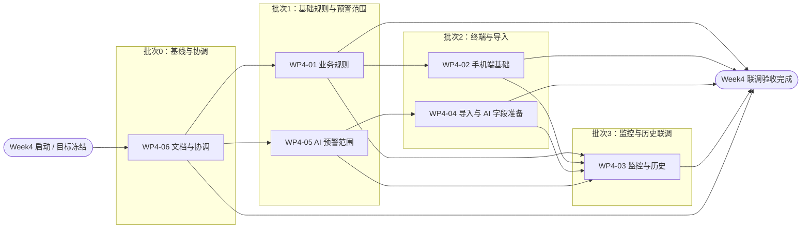

# Week 4 周迭代：WMS 业务补全、移动端与 AI 预警准备

> 历史旧称/废弃旧称：本文件为 Week 4 历史迭代资料。文中出现的“看板/kanban”术语仅保留历史上下文，不代表当前产品口径；当前统一使用“库存标签 / 库存标签码 / inventory_tag”。

## 背景输入

Week 4 基于 Week 3 出库管理、基础数据 CRUD、入库增强、库存预警、看板生命周期，以及 Week 4 锁货功能设计继续推进。本周需求不再只是锁货增强，而是补齐 WMS 演示闭环中的业务短板，并为手机端和 AI 预警方向做基础建设。

相关规格：

- `docs/specs/2026-06-15-outbound-master-data-inbound-enhancement-design.md`
- `docs/specs/2026-06-17-lock-goods-design.md`
- `docs/specs/2026-06-23-wms-completion-requirements.md`
- `docs/specs/2026-06-23-ai-warning-scope.md`
- `docs/specs/2026-06-23-ai-data-import-template.md`

## 本周目标

- 完成入库、出库、封存解封、库存监控、看板监控、出入库历史、先进先出等功能补全。
- 在既有箱级出库基础上支持散件出库，处理一箱剩余零头的库存口径。
- 提供手机端基本扫码能力，支撑入库、出库和看板查询演示。
- 增加表格批量导入能力，支持基础数据或业务单据快速准备。
- 确认 WMS 融合 AI 的近期方向，并围绕缺货/呆滞报废预警准备数据字段和规则雏形。
- 持续维护技术债、产品债和验收记录。

## 工作包列表

| WP | 工作包 | 主要需求 | 交付物 | 依赖 | 验收标准 | 建议分支 |
| --- | --- | --- | --- | --- | --- | --- |
| WP4-01 | 业务规则补全 | 封存/解封、手动锁库、散件出库、零头库存、FIFO 修正 | 后端状态模型、接口、前端操作入口、审计记录 | 现有锁货和看板状态 | 封存库存不参与普通出库；散件出库后剩余数量可查可追溯；FIFO 对整箱和散件有效 | `feature/week4-business-rules` |
| WP4-02 | 手机端基本功能 | 登录、扫码入库、扫码出库、看板查询、异常提示 | 手机端页面或移动端 H5 原型、API 适配、联调记录 | 现有认证、扫码入库、出库 pick 接口 | 手机端可完成登录、扫码入库、带单/不带单出库和看板状态查询演示 | `feature/week4-mobile-basic` |
| WP4-03 | 监控与历史 | 库存监控、看板监控、入库历史、出库历史、预警状态 | Web 查询页、筛选接口、状态口径说明 | 入库/出库/看板/库存流水数据 | 可按物料、供应商、仓库、库位、状态和时间筛选；监控数量与流水一致 | `feature/week4-monitor-history` |
| WP4-04 | 批量导入与数据准备 | 表格批量导入、错误行反馈、导入摘要、AI 分析字段准备 | 导入模板、导入接口、导入结果页面或日志、样例数据 | 基础数据和单据模型稳定 | 可导入至少一个高价值数据集；失败行有明确原因；导入数据可用于库存/AI 预警分析 | `feature/week4-import-ai-prep` |
| WP4-05 | AI 预警方向规格 | 四个 AI 方向取舍、缺货/呆滞报废识别目标、规则型预警雏形 | AI 方向说明、字段清单、规则口径、产品债更新 | 批量导入和库存历史数据 | 明确本周 AI 不训练模型；输出缺货/呆滞风险的可解释规则或数据准备方案 | `docs/week4-ai-scope` |
| WP4-06 | 文档与集成协调 | Week4 总体规格、iteration 目标、工作包拆解、债务跟踪、验收记录 | 文档索引更新、产品债/技术债更新、验收清单 | 全部工作包 | 文档能指导实现和验收；未决问题有债务记录；并行分支回合前有明确验证门禁 | `docs/week4-scope` |

## 工作包进度管理

状态枚举：

- `未开始`：已纳入本周范围，尚未开始实现。
- `进行中`：正在实现或正在细化规格。
- `阻塞`：存在未解决依赖或业务语义。
- `待验收`：实现完成，等待集成。
- `已完成`：已合入 `dev/iter4` 并完成验收记录。

| WP | 状态 | 执行者 | 分支 | 执行计划 | 验证状态 | 当前风险 |
| --- | --- | --- | --- | --- | --- | --- |
| WP4-01 | 已完成 | subagent + main agent | `feature/week4-business-rules` -> `dev/iter4` | `docs/exec-plans/completed/2026-06-23-business-rules.md` | `mvn test` 通过；前端测试与构建通过 | FIFO 例外策略仍记录为 `PD-014` |
| WP4-02 | 已完成 | subagent + main agent | `feature/week4-mobile-basic` -> `dev/iter4` | `docs/exec-plans/completed/2026-06-23-mobile-basic.md` | `npm test` 通过；`npm run build` 通过 | 真实摄像头扫码/PDA 协议不进入本周 |
| WP4-03 | 已完成 | subagent + main agent | `feature/week4-monitor-history` -> `dev/iter4` | `docs/exec-plans/completed/2026-06-23-monitor-history.md` | `npm test` 通过；`npm run build` 通过 | 历史筛选首期有前端二次过滤 |
| WP4-04 | 已完成 | subagent + main agent | `feature/week4-import-ai-prep` -> `dev/iter4` | `docs/exec-plans/completed/2026-06-23-import-ai-prep.md` | `mvn test` 通过；前端测试与构建通过 | 首期固定 CSV，不做 Excel 自由格式 |
| WP4-05 | 已完成 | subagent + main agent | `docs/week4-ai-scope` -> `dev/iter4` | `docs/exec-plans/completed/2026-06-23-ai-warning-scope.md` | 文档自检与 `git diff --check` 通过 | 真实模型训练和阈值校准进入产品债 |
| WP4-06 | 已完成 | main agent | `dev/iter4` | `docs/exec-plans/completed/2026-06-23-docs-coordination.md` | 文档收口自检；最终门禁见验证记录 | 已完成工作包分支仍保留用于审计，可后续清理 |

## 依赖关系

- WP4-06 先建立总体规格、执行计划和依赖网络，再贯穿全程维护。
- WP4-01 是业务规则关键路径；WP4-02、WP4-03 的封存、散件、FIFO 展示依赖它的最终状态和数量口径。
- WP4-05 先冻结 AI 方向和预警字段目标，再反馈给 WP4-04 的导入模板与 WP4-03 的预警展示。
- WP4-04 可与 WP4-02 并行，但如果导入对象包含库存初始化或入库单，需要遵循 WP4-01 的库存口径。
- WP4-03 是监控与历史的汇合点，最终联调依赖 WP4-01、WP4-02、WP4-04、WP4-05 的主干输出。
- 最终收口由 WP4-06 更新验收记录、债务跟踪和遗留风险。



## 执行批次

| 批次 | 工作包 | 前置条件 | 并行度 | 交付门禁 |
| --- | --- | --- | --- | --- |
| 第 0 批 | WP4-06 文档与集成协调 | Week4 需求确认 | 1 | 总体规格、iteration、工作包级执行计划、依赖网络完成 |
| 第 1 批 | WP4-01、WP4-05 | 第 0 批完成 | 2 | WP4-01 输出统一库存规则口径；WP4-05 输出 AI 方向取舍、预警目标和规则雏形边界 |
| 第 2 批 | WP4-02、WP4-04 | WP4-01 规则稳定；WP4-05 字段目标稳定 | 2 | 手机端完成登录、扫码主流程、异常提示；导入完成错误行反馈、导入摘要、字段准备 |
| 第 3 批 | WP4-03 | WP4-01、WP4-02、WP4-04、WP4-05 均完成主干功能并冻结接口 | 1 | 监控、历史、预警状态可基于真实业务流闭环展示 |
| 第 4 批 | WP4-06 收口 | 前述工作包通过联调 | 1 | 完成验收记录、遗留风险登记、债务追踪更新、Week4 文档收口 |

## 关键路径

存在两条实际关键路径，最终在 WP4-03 汇合：

```text
WP4-06 -> WP4-01 -> WP4-02 -> WP4-03 -> WP4-06 收口
WP4-06 -> WP4-05 -> WP4-04 -> WP4-03 -> WP4-06 收口
```

其中 WP4-03 是收敛点，也是最容易拖延整周验收的工作包。建议先冻结口径，再铺功能入口，最后收监控与历史，避免页面先完成但业务语义仍在变。

建议合并顺序：

1. 先合并 WP4-06 的 Week4 基线文档、计划和依赖网络。
2. 再分别合并 WP4-01 与 WP4-05，确保规则和预警范围先稳定。
3. 合并 WP4-04，前提是 AI 字段准备已与 WP4-05 对齐。
4. 合并 WP4-02，前提是已基于 WP4-01 完成重放和异常路径检查。
5. 最后合并 WP4-03，要求其基于最新 WP4-01、WP4-02、WP4-04、WP4-05 结果完成联调。
6. WP4-06 的验收记录、债务跟踪、遗留项清单最后收口。

## 明确不做

- 不接入真实 MES、ERP、SAP。
- 不接入真实 PDA、扫码枪、标签机或打印机协议。
- 不训练真实 AI 模型。
- 不做完整角色权限体系。
- 不做复杂审批流、财务核算、完整质量报废流程。

## 验收标准

- 本周工作包均有清晰边界、依赖和验收方式。
- 进入实现的工作包均有对应规格或执行计划。
- 后端行为变更通过 `mvn test`，无法运行时记录原因。
- 前端逻辑变更通过 `npm test`，路由、依赖、构建或主样式变更通过 `npm run build`。
- 并行工作通过独立 worktree 或独立 feature 分支推进，并合回 `dev/iter4`。
- 未决业务语义记录到 `docs/exec-plans/product-debt-tracker.md`，可工程化解决的问题记录到 `docs/exec-plans/tech-debt-tracker.md`。

## 验证记录

| 时间 | 范围 | 验证命令 | 结果 | 说明 |
| --- | --- | --- | --- | --- |
| 2026-06-23 | WP4-01 业务规则集成 | `cd backend && mvn test` | 通过，40 tests | 覆盖封存/解封、手动锁库、散件出库、FIFO、AI 导入测试 |
| 2026-06-23 | WP4-01/WP4-04/WP4-02/WP4-03 前端集成 | `cd frontend && npm test` | 通过，5 files / 27 tests | 覆盖路由、移动端 API wrapper、监控规则工具 |
| 2026-06-23 | 前端构建 | `cd frontend && npm run build` | 通过 | 保留既有 Vite PURE comment 与 chunk size warning |
| 2026-06-23 | WP4-05/WP4-06 文档与合并结果 | `git diff --check` | 通过 | 合并冲突已处理，产品债编号保留 `PD-009` 至 `PD-014` |

## 遗留技术债与产品债

- 产品债：外部 AI 方向、AI 仓库管理员、真实模型训练、阈值校准和 FIFO 例外策略分别记录在 `PD-009` 至 `PD-014`。
- 技术债：缺少 CI 验证门禁、认证仍是 demo token、`DatabaseMigration` 在 H2 测试环境仍有兼容告警、前端主包存在 chunk size warning。
- 清理项：本轮并行 worktree 和短生命周期分支已完成集成，后续可按审计需求清理。
