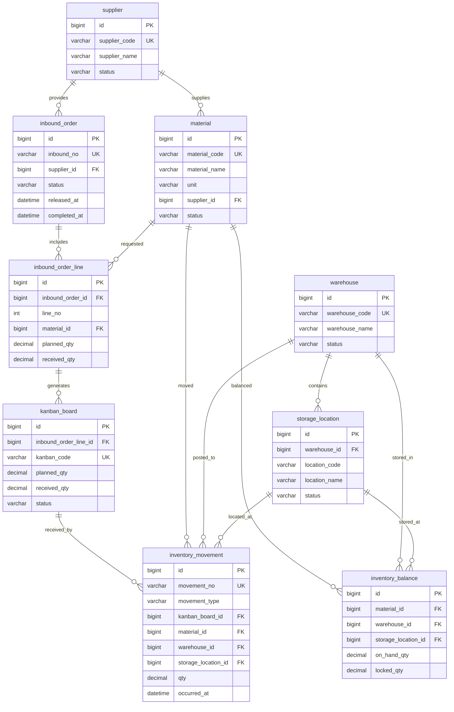

# Week 2 采购入库数据模型审查

## 1. 当前核心表 ER 图设计

本图表达本周建议落地的简化模型，不包含延后的 `container_type`，也不单独保留 `scan_record`。扫码成功后的业务事实进入 `inventory_movement`；失败扫码不落库，只在接口响应或前端提示中体现。入库单状态不使用 `PENDING`，待执行状态统一为 `RELEASED`。



原始方案为 11 张表；本周建议简化后为 9 张表。差异是：

- 延后 `container_type`：器具类型属于基础资料扩展，本周采购入库闭环不依赖真实器具类型维护。
- 取消独立 `scan_record`：成功扫码直接形成入库流水 `inventory_movement`，失败扫码不落库。
- 保留 `inventory_movement` 与 `inventory_balance`：流水记录事实，余额支撑库存查询，二者职责不同。
- 入库单初始可执行状态从 `PENDING` 改为 `RELEASED`，避免把“已下发待收货”和“草稿未释放”混在一个状态里。

## 2. 原始表设计 schema

以下 schema 是被审查的原始 11 表方案，用于表达采购入库闭环、基础资料、扫码记录、库存流水和库存余额。字段以本周业务审查所需的最小语义为准，不代表已经实现数据库迁移。

```sql
CREATE TABLE supplier (
  id BIGINT PRIMARY KEY,
  supplier_code VARCHAR(64) NOT NULL UNIQUE,
  supplier_name VARCHAR(128) NOT NULL,
  contact_name VARCHAR(64),
  contact_phone VARCHAR(32),
  status VARCHAR(32) NOT NULL,
  created_at DATETIME NOT NULL,
  updated_at DATETIME NOT NULL
);

CREATE TABLE material (
  id BIGINT PRIMARY KEY,
  material_code VARCHAR(64) NOT NULL UNIQUE,
  material_name VARCHAR(128) NOT NULL,
  specification VARCHAR(128),
  unit VARCHAR(32) NOT NULL,
  supplier_id BIGINT,
  status VARCHAR(32) NOT NULL,
  created_at DATETIME NOT NULL,
  updated_at DATETIME NOT NULL,
  CONSTRAINT fk_material_supplier FOREIGN KEY (supplier_id) REFERENCES supplier(id)
);

CREATE TABLE warehouse (
  id BIGINT PRIMARY KEY,
  warehouse_code VARCHAR(64) NOT NULL UNIQUE,
  warehouse_name VARCHAR(128) NOT NULL,
  status VARCHAR(32) NOT NULL,
  created_at DATETIME NOT NULL,
  updated_at DATETIME NOT NULL
);

CREATE TABLE storage_location (
  id BIGINT PRIMARY KEY,
  warehouse_id BIGINT NOT NULL,
  location_code VARCHAR(64) NOT NULL,
  location_name VARCHAR(128) NOT NULL,
  location_type VARCHAR(32),
  status VARCHAR(32) NOT NULL,
  created_at DATETIME NOT NULL,
  updated_at DATETIME NOT NULL,
  CONSTRAINT uk_storage_location UNIQUE (warehouse_id, location_code),
  CONSTRAINT fk_location_warehouse FOREIGN KEY (warehouse_id) REFERENCES warehouse(id)
);

CREATE TABLE container_type (
  id BIGINT PRIMARY KEY,
  container_code VARCHAR(64) NOT NULL UNIQUE,
  container_name VARCHAR(128) NOT NULL,
  capacity_qty DECIMAL(18, 3),
  status VARCHAR(32) NOT NULL,
  created_at DATETIME NOT NULL,
  updated_at DATETIME NOT NULL
);

CREATE TABLE inbound_order (
  id BIGINT PRIMARY KEY,
  inbound_no VARCHAR(64) NOT NULL UNIQUE,
  supplier_id BIGINT NOT NULL,
  source_doc_no VARCHAR(64),
  status VARCHAR(32) NOT NULL,
  planned_arrival_date DATE,
  released_at DATETIME,
  completed_at DATETIME,
  created_at DATETIME NOT NULL,
  updated_at DATETIME NOT NULL,
  CONSTRAINT fk_inbound_order_supplier FOREIGN KEY (supplier_id) REFERENCES supplier(id)
);

CREATE TABLE inbound_order_line (
  id BIGINT PRIMARY KEY,
  inbound_order_id BIGINT NOT NULL,
  line_no INT NOT NULL,
  material_id BIGINT NOT NULL,
  planned_qty DECIMAL(18, 3) NOT NULL,
  received_qty DECIMAL(18, 3) NOT NULL DEFAULT 0,
  container_type_id BIGINT,
  remark VARCHAR(255),
  created_at DATETIME NOT NULL,
  updated_at DATETIME NOT NULL,
  CONSTRAINT uk_inbound_order_line UNIQUE (inbound_order_id, line_no),
  CONSTRAINT fk_inbound_line_order FOREIGN KEY (inbound_order_id) REFERENCES inbound_order(id),
  CONSTRAINT fk_inbound_line_material FOREIGN KEY (material_id) REFERENCES material(id),
  CONSTRAINT fk_inbound_line_container FOREIGN KEY (container_type_id) REFERENCES container_type(id)
);

CREATE TABLE kanban_board (
  id BIGINT PRIMARY KEY,
  inbound_order_line_id BIGINT NOT NULL,
  kanban_code VARCHAR(96) NOT NULL UNIQUE,
  material_id BIGINT NOT NULL,
  planned_qty DECIMAL(18, 3) NOT NULL,
  received_qty DECIMAL(18, 3) NOT NULL DEFAULT 0,
  status VARCHAR(32) NOT NULL,
  printed_at DATETIME,
  created_at DATETIME NOT NULL,
  updated_at DATETIME NOT NULL,
  CONSTRAINT fk_kanban_line FOREIGN KEY (inbound_order_line_id) REFERENCES inbound_order_line(id),
  CONSTRAINT fk_kanban_material FOREIGN KEY (material_id) REFERENCES material(id)
);

CREATE TABLE scan_record (
  id BIGINT PRIMARY KEY,
  kanban_board_id BIGINT,
  kanban_code VARCHAR(96) NOT NULL,
  scan_result VARCHAR(32) NOT NULL,
  failure_reason VARCHAR(255),
  operator_id BIGINT,
  scanned_at DATETIME NOT NULL,
  created_at DATETIME NOT NULL,
  CONSTRAINT fk_scan_kanban FOREIGN KEY (kanban_board_id) REFERENCES kanban_board(id)
);

CREATE TABLE inventory_balance (
  id BIGINT PRIMARY KEY,
  material_id BIGINT NOT NULL,
  warehouse_id BIGINT NOT NULL,
  storage_location_id BIGINT NOT NULL,
  on_hand_qty DECIMAL(18, 3) NOT NULL DEFAULT 0,
  locked_qty DECIMAL(18, 3) NOT NULL DEFAULT 0,
  updated_at DATETIME NOT NULL,
  CONSTRAINT uk_inventory_balance UNIQUE (material_id, warehouse_id, storage_location_id),
  CONSTRAINT fk_balance_material FOREIGN KEY (material_id) REFERENCES material(id),
  CONSTRAINT fk_balance_warehouse FOREIGN KEY (warehouse_id) REFERENCES warehouse(id),
  CONSTRAINT fk_balance_location FOREIGN KEY (storage_location_id) REFERENCES storage_location(id)
);

CREATE TABLE inventory_movement (
  id BIGINT PRIMARY KEY,
  movement_no VARCHAR(64) NOT NULL UNIQUE,
  movement_type VARCHAR(32) NOT NULL,
  kanban_board_id BIGINT,
  material_id BIGINT NOT NULL,
  warehouse_id BIGINT NOT NULL,
  storage_location_id BIGINT NOT NULL,
  qty DECIMAL(18, 3) NOT NULL,
  occurred_at DATETIME NOT NULL,
  created_at DATETIME NOT NULL,
  CONSTRAINT fk_movement_kanban FOREIGN KEY (kanban_board_id) REFERENCES kanban_board(id),
  CONSTRAINT fk_movement_material FOREIGN KEY (material_id) REFERENCES material(id),
  CONSTRAINT fk_movement_warehouse FOREIGN KEY (warehouse_id) REFERENCES warehouse(id),
  CONSTRAINT fk_movement_location FOREIGN KEY (storage_location_id) REFERENCES storage_location(id)
);
```

## 3. 原始数据表范式审查

### 1NF

原始 11 表基本满足 1NF：字段保持原子值，没有把多个物料、多个库位或多次扫码塞入单个字段。主要风险在枚举文本字段未收敛，例如 `status`、`movement_type`、`scan_result`、`location_type`，如果允许自由文本，会造成同一业务状态出现多种写法。建议先在应用层和规格中固定枚举值，本周不额外建状态字典表。

### 2NF

大部分表使用单列代理主键，不存在典型的复合主键局部依赖。需要注意两个唯一键对应的事实边界：

- `inbound_order_line` 的自然唯一键是 `(inbound_order_id, line_no)`，行号只在单据内有意义。
- `inventory_balance` 的自然唯一键是 `(material_id, warehouse_id, storage_location_id)`，余额字段依赖完整库存维度。

若未来把上述唯一键改为复合主键，必须保证非键字段依赖完整复合键，不能只依赖其中某一列。

### 3NF

原始方案存在若干传递依赖或冗余同步风险：

- `kanban_board.material_id` 可由 `kanban_board.inbound_order_line_id -> inbound_order_line.material_id` 推导，重复存储会带来物料不一致风险。
- `scan_record.kanban_code` 与 `scan_record.kanban_board_id -> kanban_board.kanban_code` 重复。若扫码失败时没有可解析看板，只保留失败文本又会混合“业务事实”和“错误日志”两类数据。
- `inventory_movement.material_id` 可由 `kanban_board_id -> inbound_order_line_id -> material_id` 推导，但库存流水需要保留发生时的物料事实，允许作为审计快照保留。
- `storage_location` 已归属 `warehouse`，`inventory_balance` 和 `inventory_movement` 同时保存 `warehouse_id` 与 `storage_location_id` 时存在库位和仓库不一致风险。为便于查询可以保留，但必须校验库位属于该仓库。

### BCNF

主要 BCNF 风险来自“业务编码也是候选键”的表：

- `supplier_code`、`material_code`、`warehouse_code`、`kanban_code`、`movement_no` 都是候选键，应保持唯一且不可复用。
- `storage_location` 的候选键是 `(warehouse_id, location_code)`，不能假设 `location_code` 全局唯一，除非业务明确要求。
- `scan_record` 同时允许 `kanban_board_id` 和 `kanban_code` 决定部分看板信息，决定因素不单一，是取消该表的主要原因之一。

## 4. 化简建议

本周目标是采购入库核心闭环，不扩展到 Android、移动端摄像头、基础信息 CRUD 或真实打印机。数据模型应服务于“下发入库单、生成看板、扫码收货、产生库存流水、更新库存余额”的最短闭环。

化简建议如下：

- 保留 `supplier`、`material`、`warehouse`、`storage_location` 作为必要引用数据，但本周只需要可被入库单引用的种子数据或后端内置数据，不做完整基础资料 CRUD。
- 保留 `inbound_order` 和 `inbound_order_line`，入库单头记录供应商和状态，行记录物料、计划数量和已收数量。
- 保留 `kanban_board` 表承载唯一看板编码、计划收货数量和收货状态；本周不接真实打印机，只生成可展示或可复制的看板编码。
- 延后 `container_type`，因为器具容量和器具基础资料不会阻塞采购入库闭环。
- 合并或取消 `scan_record`，成功扫码以 `inventory_movement` 作为唯一持久化事实；失败扫码不落库，避免把临时错误、设备噪声或用户误扫沉淀为业务数据。
- 保留 `inventory_movement`，用于记录每次成功入库的数量、库位、看板和发生时间。
- 保留 `inventory_balance`，用于按物料、仓库、库位查询现存量；它由成功入库流水驱动更新，不替代流水。
- 入库单状态使用 `RELEASED` 表达“已释放、可扫码收货”，不使用 `PENDING`。建议状态集合为 `DRAFT`、`RELEASED`、`PARTIAL_RECEIVED`、`COMPLETED`、`CANCELLED`，本周可只实现闭环需要的子集。

## 5. 最终建议的本周最小持久化模型

本周最终建议持久化 9 张表：

| 表名 | 本周职责 | 关键约束 |
| --- | --- | --- |
| `supplier` | 供应商引用数据，支撑入库单来源 | `supplier_code` 唯一 |
| `material` | 物料引用数据，支撑入库明细和库存 | `material_code` 唯一，可关联默认供应商 |
| `warehouse` | 仓库引用数据 | `warehouse_code` 唯一 |
| `storage_location` | 库位引用数据 | `(warehouse_id, location_code)` 唯一 |
| `inbound_order` | 入库单头，记录供应商、来源单号、状态和完成时间 | `inbound_no` 唯一，状态使用 `RELEASED` 作为可收货状态 |
| `inbound_order_line` | 入库单行，记录物料、计划数量和已收数量 | `(inbound_order_id, line_no)` 唯一 |
| `kanban_board` | 唯一看板，连接入库明细与扫码收货 | `kanban_code` 唯一 |
| `inventory_movement` | 成功扫码后的入库流水 | `movement_no` 唯一，`movement_type = INBOUND_RECEIVE` |
| `inventory_balance` | 物料在仓库和库位上的库存余额 | `(material_id, warehouse_id, storage_location_id)` 唯一 |

建议的本周最小 schema 调整：

- 从 `inbound_order_line` 移除 `container_type_id`，等器具管理进入后续周迭代时再恢复或另建关联。
- 从 `kanban_board` 移除可推导的 `material_id`，通过 `inbound_order_line` 获取物料；若实现层为了查询性能保留该字段，必须在写入时校验它与明细物料一致。
- 不创建 `scan_record` 表。扫码成功时新增 `inventory_movement`，同步累加 `inbound_order_line.received_qty`、`kanban_board.received_qty` 和 `inventory_balance.on_hand_qty`；扫码失败时返回失败原因但不持久化。
- `inventory_movement` 可保留 `material_id`、`warehouse_id`、`storage_location_id` 作为发生事实快照，但必须校验 `storage_location_id` 属于同一个 `warehouse_id`。
- `inventory_balance` 不记录历史原因，只记录当前余额；历史追溯统一查 `inventory_movement`。

本周不做范围：

- 不做 Android 或移动端摄像头集成。
- 不做供应商、物料、仓库、库位的完整基础信息 CRUD。
- 不做真实打印机或打印协议，只保留看板编码生成与展示所需数据。
- 不做失败扫码持久化、设备日志持久化或审计日志体系。
