# Week 4 FR Acceptance Test Results

本文件记录 Week 4 FR-01 至 FR-09 的人工验收执行结果。
验收步骤见 `week4-fr-acceptance-test-steps.md`。

## 0. 验收批次信息

- 验收环境：本地演示环境
- Web 前端：`http://localhost:5173`
- 后端：`http://localhost:8080`
- 手机端 H5：`http://localhost:5173/mobile/inbound`
- 演示账号：`admin` / `123456`
- 固定演示库：待确认
- 自动化门禁结果：待确认

## 1. 总体结论

| FR | 需求名称 | 结论 | 遗留问题 |
| --- | --- | --- | --- |
| FR-01 | 入库功能补全 | 通过 | 入库单新建、容器选择、释放生成库存标签、扫码/手机端入库、历史/追溯和库存联动均确认正常。 |
| FR-02 | 出库功能补全 | 不通过 | 容器类型已可选择，但创建出库单时报“服务器内部错误，请查看日志”，阻断出库单保存、释放加锁、带单/不带单出库、FIFO 和出库历史验收。 |
| FR-03 | 封存与解封 | 阻塞 | 当前已知手动封存/解封能力存在，但本轮未形成完整人工补验证据；普通出库和自动 FIFO 锁货排除验证受 FR-02 阻断未执行。 |
| FR-04 | 手动锁库 | 有条件通过 | 手动锁定/解锁、库存数据联动和人工占用记录查询通过；出库锁与手动锁冲突场景因 FR-02 阻断未验证。 |
| FR-05 | 手机端基本功能 | 有条件通过 | 手机端入库、库存标签查询和库存联动通过；手机端出库受 FR-02 阻断未验证，异常提示未单独补验。 |
| FR-06 | 当前库存监控 | 有条件通过 | 当前库存数量、物料/仓库/库位筛选和库存总览通过；导入/风险区域仍为数据未准备或未完整制作，出库锁定和零头场景受 FR-02 阻断未验证，封存数量场景受 FR-03 阻塞未形成有效复验证据。 |
| FR-07 | 库存标签监控 | 有条件通过 | 库存标签列表筛选、数量字段和库存标签详情通过；库存标签追溯页未单独截图验证，SHIPPED/当前锁定状态受 FR-02 阻断未验证，封存状态联动受 FR-03 阻塞未形成有效复验证据。 |
| FR-08 | 表格批量导入 | 跳过验收 | 当前交付物将表格批量导入与 AI 样例数据准备耦合，偏离 FR-08 独立表格导入需求；待返工后重验。 |
| FR-09 | AI 预警准备 | 跳过验收 | 当前实现偏离“基于现有数据进行智能推荐/风险预警”的独立需求，未形成可验收对象；待返工后重验。 |

## FR-01 入库功能补全

```text
FR 编号：FR-01
验收人：用户验收，姓名待补
验收时间：2026-06-24 19:13 CST
前置数据：使用当前本地演示环境；前序手机端入库验收中已产生并完成入库的库存标签码（历史记录旧前缀） `KB:v1:IN-20260624-39A78DBC:1:1` 可作为入库闭环证据，验收人本轮确认 FR-01 所有入库功能均正常。
操作步骤：复验入库单新建、供应商/物料/库位/容器选择、保存、释放生成库存标签、库存标签/入库单打印展示、扫码或手机端手工输入库存标签码入库、入库历史查询、库存追溯或库存标签追溯。
预期结果：见 week4-fr-acceptance-test-steps.md#fr-01-入库功能补全
实际结果：验收人确认入库相关功能均正常；旧失败点“新建入库单时无法选中已创建容器”已不再复现。系统可完成入库单新建与保存，释放后生成库存标签码，入库单/库存标签信息可查看，扫码或手机端手工输入库存标签码后可完成入库；入库后库存数量联动正常，入库历史、库存追溯或库存标签追溯可查询本次入库相关记录。
结论：通过
遗留问题：无。
截图或日志：本轮未新增截图；可复用 FR-05 中入库单释放、库存标签详情、手机端入库完成、手机端库存标签查询和当前库存联动截图作为入库闭环证据。
```

## FR-02 出库功能补全

```text
FR 编号：FR-02
验收人：用户验收，姓名待补
验收时间：2026-06-24 19:17 CST
前置数据：系统中存在可用于出库的 `5WD 723 913 C` 物料库存；新建出库单时已选择出库用途 `生产领料`，新增明细选择供应商 `8KH`、物料 `5WD 723 913 C`、容器类型 `集装箱`，箱数 `1`，总件数 `1000`。
操作步骤：进入出库管理 -> 出库单；点击新建出库单；选择出库用途；新增出库明细；选择供应商、物料、容器类型和箱数；点击创建。
预期结果：见 week4-fr-acceptance-test-steps.md#fr-02-出库功能补全
实际结果：容器类型已可选择，旧问题“容器下拉无数据/物料未配置包装容器”在本轮未复现；但点击创建时页面提示“服务器内部错误，请查看日志”，出库单未能创建。后续释放并加锁、带单出库、按件出库、FIFO 提示/阻断、不带单出库和出库历史查询未继续执行。
结论：不通过
遗留问题：需排查后端创建出库单接口内部错误，包括请求入参、出库明细字段映射、容器类型/箱数/件数换算、库存校验和数据库约束；修复后重新执行 FR-02 全流程验收。
截图或日志：见下方 FR-02 证据截图。
```

FR-02 证据截图：

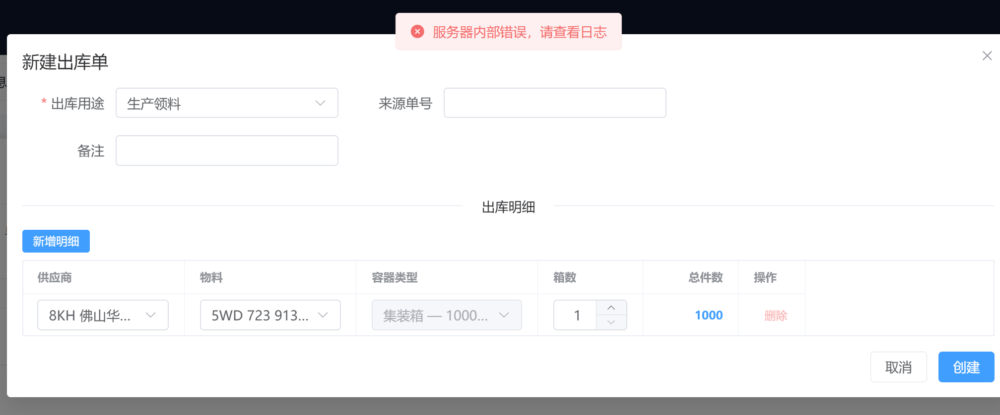

## FR-03 封存与解封

```text
FR 编号：FR-03
验收人：用户验收，姓名待补
验收时间：2026-06-24 19:24 CST
前置数据：尝试使用当前本地演示环境中可用于封存/解封验证的已入库库存标签。
操作步骤：按验收步骤准备进入库存标签列表并执行封存/解封相关操作。
预期结果：见 week4-fr-acceptance-test-steps.md#fr-03-封存与解封
实际结果：当前已知系统具备手动封存和手动解封入口，但本轮复验未形成可引用的完整人工补验证据，因此不能据此判定 FR-03 通过。普通出库和自动 FIFO 锁货对封存库存的排除验证受 FR-02 出库单创建/锁货路径阻断，未能继续执行；封存审计查询和当前库存封存数量联动也未形成有效复验记录。
结论：阻塞，无法验收
遗留问题：需先解除 FR-03 主流程阻塞，并在 FR-02 出库单创建/锁货路径恢复后，补验“封存库存不参与普通出库和自动 FIFO 锁货”。
截图或日志：本轮未提供新增截图；仅记录验收人反馈的阻塞结论。
```

## FR-04 手动锁库

```text
FR 编号：FR-04
验收人：用户验收，姓名待补
验收时间：2026-06-24 17:11 CST
前置数据：库存标签列表中存在已入库且可用的库存标签；当前库存页面可查看对应物料的可用数量和手锁数量。
操作步骤：进入库存标签信息 -> 库存标签列表；对可用库存标签执行手动锁库；查看库存标签列表中的主动占用和封存/手锁状态；进入库存监控 -> 当前库存查看手锁数量变化；返回库存标签列表执行手动解锁；再次查看库存标签列表和当前库存。
预期结果：见 week4-fr-acceptance-test-steps.md#fr-04-手动锁库
实际结果：能够完成手动锁定和手动解锁；手动锁定后库存标签列表显示主动占用为手动锁库，当前库存中手锁数量增加、可用数量减少；手动解锁成功后库存标签恢复可流转状态，当前库存中手锁数量回落、可用数量恢复。补充验证显示，锁库管理 -> 人工占用页可查询手动锁库记录，记录包含库存标签码、物料、库位、占用类型、数量、库存标签状态、记录状态、原因、操作人、创建时间和释放时间。由于 FR-02 出库单创建和锁货路径未通过，无法构造“已被出库单锁定的库存标签再执行手动锁库”的冲突验证场景。
结论：有条件通过
遗留问题：出库锁与手动锁之间的冲突提示未验证；需在 FR-02 出库单释放并加锁恢复后补验。
截图或日志：见下方 FR-04 证据截图。
```

FR-04 证据截图：

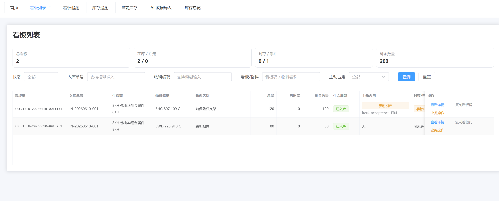

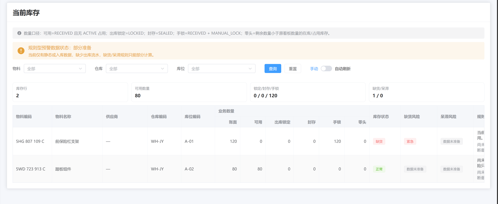

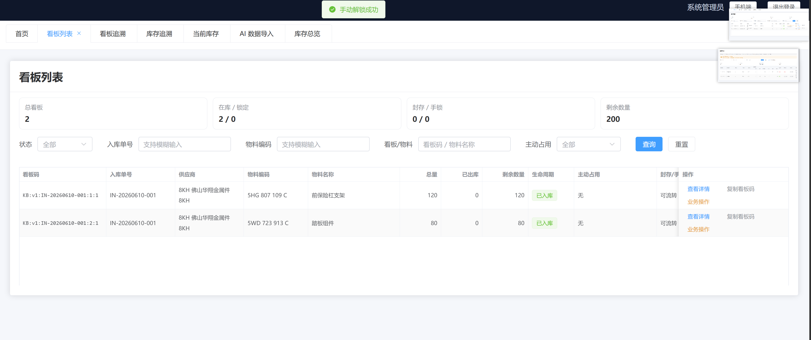

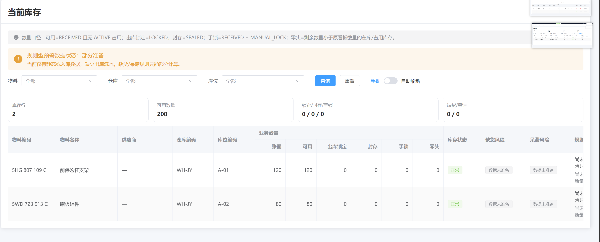

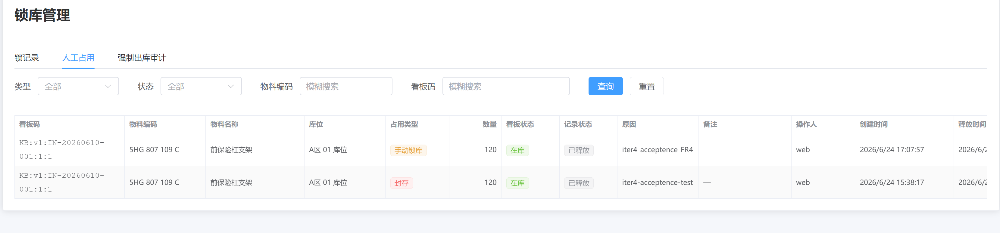

## FR-05 手机端基本功能

```text
FR 编号：FR-05
验收人：用户验收，姓名待补
验收时间：2026-06-24 17:52 CST
前置数据：Web 端创建并释放入库单 `IN-20260624-39A78DBC`；系统生成 `PRINTED` 库存标签（历史记录旧前缀） `KB:v1:IN-20260624-39A78DBC:1:1`，物料为 `5WD 723 913 C 踏板组件`，计划库位为 `A区 01 库位`，数量为 `1000`。
操作步骤：登录 Web 前端；进入入库单管理创建并释放入库单；进入库存标签详情复制库存标签码；切换到手机端 H5，手工输入库存标签码并查看入库预览；点击提交入库；在手机端库存标签查询页输入同一库存标签码；返回 Web 当前库存页面核对新增库存。
预期结果：见 week4-fr-acceptance-test-steps.md#fr-05-手机端基本功能
实际结果：手机端可手工输入 `KB:v1:IN-20260624-39A78DBC:1:1` 并识别为 `PRINTED` 库存标签，预览中显示对应物料、入库单、计划库位和数量；点击入库后显示 `COMPLETED`，收货数量为 `1000`，实际库位与计划库位均为 `A区 01 库位`，入库时间为 `2026/6/24 17:52:35`；手机端库存标签查询显示生命周期为 `RECEIVED`，总量/已出/剩余为 `1000 / 0 / 1000`，锁定/封存状态为正常；Web 当前库存中可看到新增的 `5WD 723 913 C 踏板组件` 库存，库存行数和可用数量相应增加。
结论：有条件通过
遗留问题：手机端出库主路径受 FR-02 出库单创建和锁货路径阻断，未验证带单出库和不带单出库；不存在库存标签码或不合法数量等异常提示未单独补验；历史旧称到“库存标签码”的命名收口已由 PD-016 与本修复计划覆盖。
截图或日志：见下方 FR-05 证据截图。
```

FR-05 证据截图：

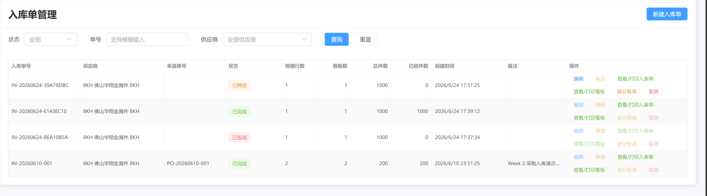


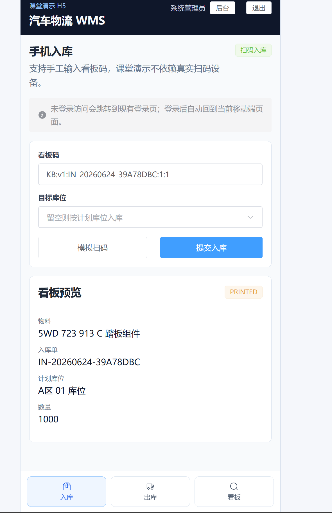

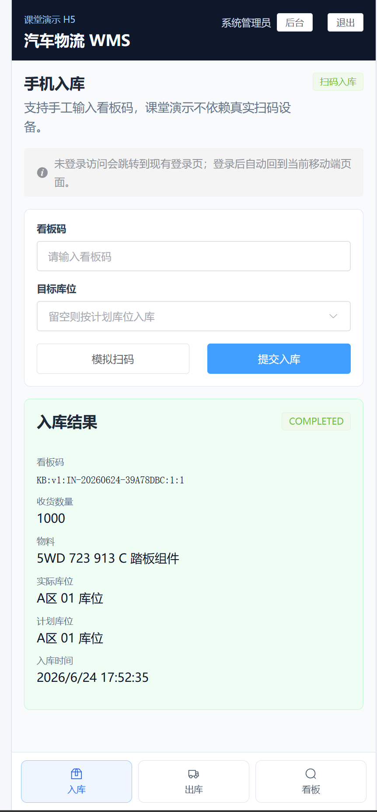

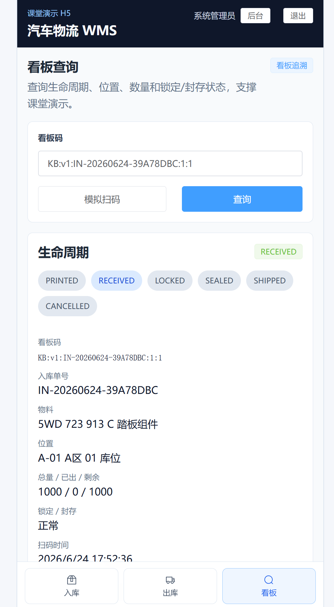

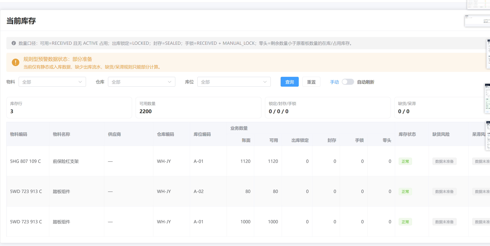

## FR-06 当前库存监控

```text
FR 编号：FR-06
验收人：用户验收，姓名待补
验收时间：2026-06-24 18:14 CST
前置数据：已完成 FR-04、FR-05 的人工验收操作；FR-03 复验当前阻塞，封存数量联动未纳入本轮有效交叉证据；当前库存中存在物料 `5HG 807 109 C 前保险杠支架` 与 `5WD 723 913 C 踏板组件`，其中 FR-05 新增 `5WD 723 913 C` 在 `A-01` 库位的 `1000` 件入库库存。
操作步骤：进入库存监控 -> 当前库存；查看全量库存汇总；按物料 `5WD 723 913 C` 筛选；按仓库 `WH-JY` 筛选；按库位 `A-01` 筛选；进入库存监控 -> 库存总览查看库位容量和物料充足性；进入导入/风险区域查看预警样例状态（当前页面旧入口名为 `AI 数据导入`）。
预期结果：见 week4-fr-acceptance-test-steps.md#fr-06-当前库存监控
实际结果：全量当前库存显示库存行 `3`、可用数量 `2200`、锁定/封存/手锁为 `0 / 0 / 0`、缺货/呆滞为 `0 / 0`；表格中 `5HG 807 109 C` 在 `A-01` 账面/可用为 `1120 / 1120`，`5WD 723 913 C` 在 `A-02` 为 `80 / 80`，`5WD 723 913 C` 在 `A-01` 为 `1000 / 1000`，各行出库锁定、封存、手锁、零头均为 `0`，库存状态为正常。按物料 `5WD 723 913 C` 筛选后显示 `2` 行、可用数量 `1080`；按仓库 `WH-JY` 筛选后显示 `3` 行、可用数量 `2200`；按库位 `A-01` 筛选后显示 `2` 行、可用数量 `2120`，与表格明细相符。库存总览中 `WH-JY` 显示 `3` 个库位，A-01 为 `3 箱 / 0 箱 (2120 件)`、A-02 为 `1 箱 / 0 箱 (80 件)`，物料充足性显示 `8KH` 供应商下 `5HG 807 109 C` 为 `1120 / 0`、`5WD 723 913 C` 为 `1080 / 0`。导入/风险区域显示规则型预警数据状态为部分准备，预警样例预览提示暂无风险样例或数据未准备；验收人说明库存总览中目前没有开始制作 FR-09 的独立 AI 推荐/风险预警功能。
结论：有条件通过
遗留问题：智能推荐/风险预警能力仍停留在数据准备或未完整制作状态；本轮未构造出库锁定和零头库存的非零场景，原因是 FR-02 出库主路径阻断；封存数量场景受 FR-03 复验阻塞影响，未形成有效复验证据；当前截图中的手锁已释放，因此只验证了回落到 `0` 后的手锁库存口径。
截图或日志：见下方 FR-06 证据截图。
```

FR-06 证据截图：

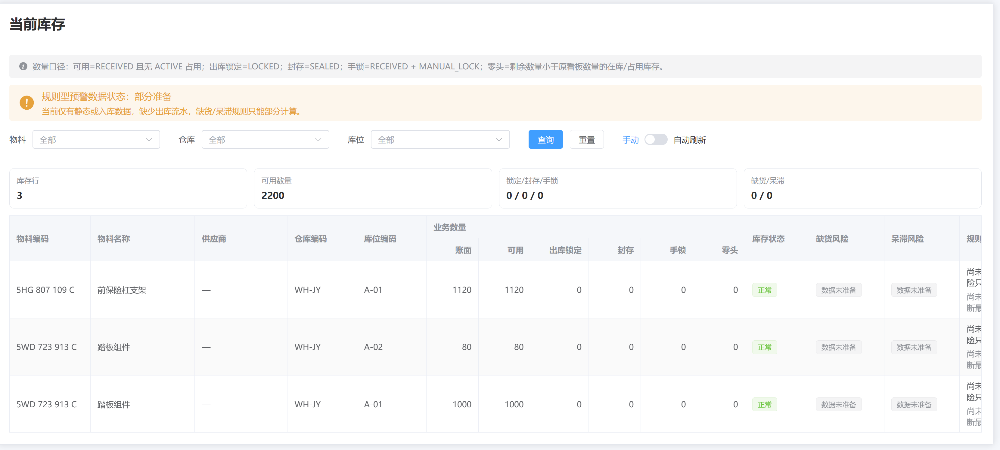

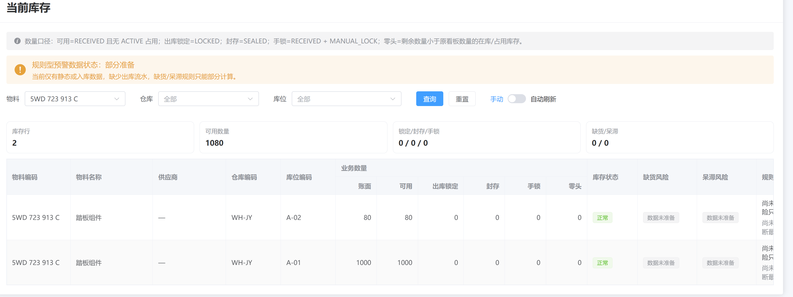

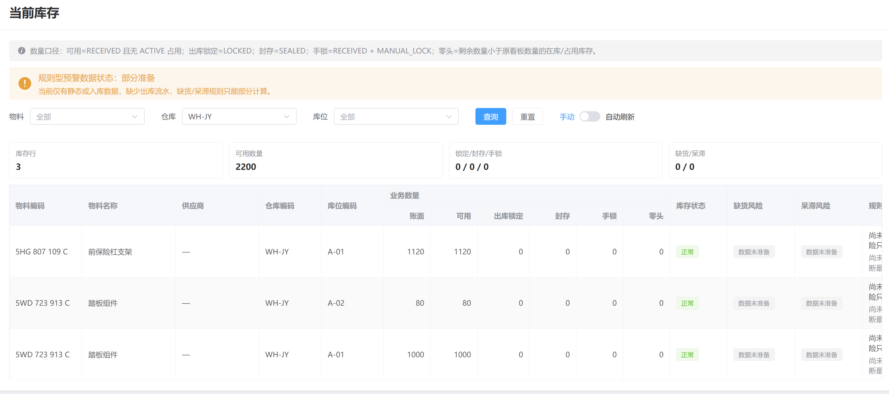

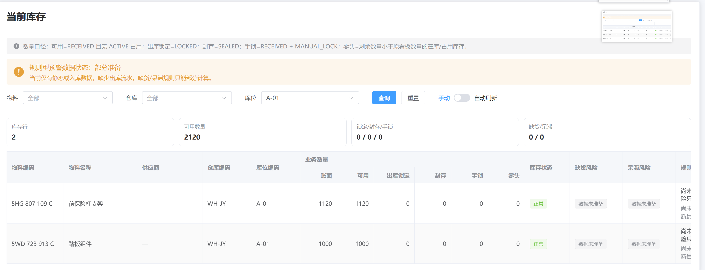

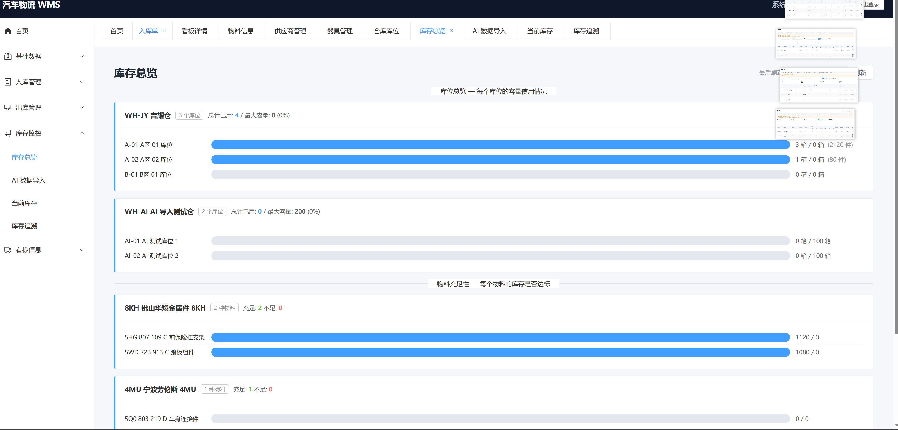

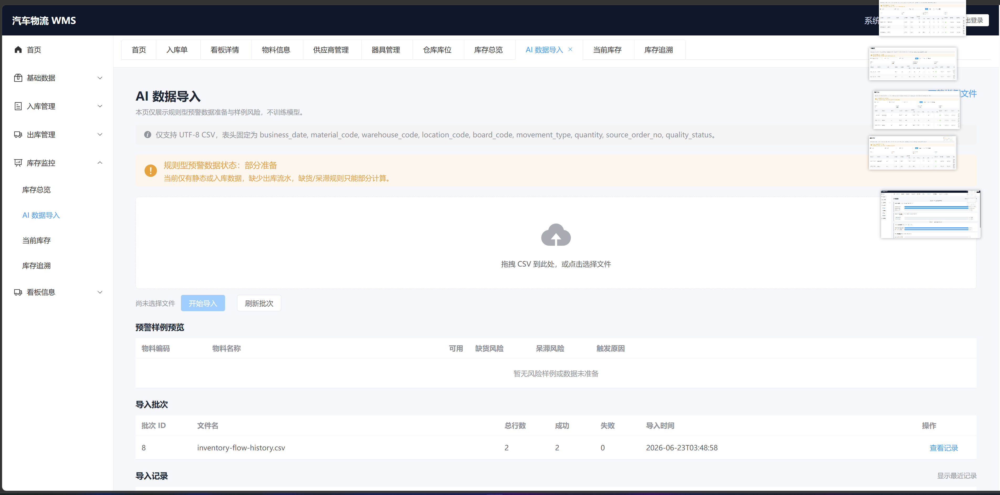

## FR-07 库存标签监控

```text
FR 编号：FR-07
验收人：用户验收，姓名待补
验收时间：2026-06-24 18:25 CST
前置数据：系统中存在 FR-05 产生的库存标签（历史记录旧前缀） `KB:v1:IN-20260624-39A78DBC:1:1`，物料为 `5WD 723 913 C 踏板组件`，入库单为 `IN-20260624-39A78DBC`，生命周期为已入库，数量为 `1000`，剩余数量为 `1000`；系统中还存在历史库存标签、已取消库存标签和 FR-04 曾操作过的手动锁库库存标签记录。
操作步骤：进入库存标签信息 -> 库存标签列表；按库存标签码/库存标签物料关键字查询 FR-05 库存标签；按物料编码 `5WD 723 913 C` 查询；按入库单 `IN-20260624-39A78DBC` 查询；按状态 `已入库` 查询；查看包含已取消库存标签的全量列表；分别按主动占用 `封存` 和 `手动锁库` 查询；打开 FR-05 库存标签详情。
预期结果：见 week4-fr-acceptance-test-steps.md#fr-07-库存标签监控
实际结果：库存标签码/库存标签物料关键字可定位 `KB:v1:IN-20260624-39A78DBC:1:1`，列表汇总显示总库存标签 `1`、在库/锁定 `1 / 0`、封存/手锁 `0 / 0`、剩余数量 `1000`；该行显示入库单 `IN-20260624-39A78DBC`、物料 `5WD 723 913 C 踏板组件`、总量 `1000`、已出库 `0`、剩余数量 `1000`、生命周期 `已入库`、主动占用 `无`、封存/手锁为可流转。按物料 `5WD 723 913 C` 查询显示 `2` 个库存标签、在库/锁定 `2 / 0`、剩余数量 `1080`，包含 FR-05 的 `1000` 件库存标签和历史 `80` 件库存标签。按入库单 `IN-20260624-39A78DBC` 查询显示 `1` 个库存标签、剩余数量 `1000`。按状态 `已入库` 查询显示 `4` 个库存标签、剩余数量 `2200`；全量列表显示 `5` 个库存标签、其中包含一条已取消库存标签，剩余数量 `3200`。按主动占用 `封存` 和 `手动锁库` 查询均显示 `No Data`，与当前无活跃封存/手锁占用一致；手动锁库状态联动已在 FR-04 中交叉验证，封存状态联动因 FR-03 复验阻塞未形成有效复验证据。库存标签详情可打开，展示库存标签码、二维码、状态 `已入库`、入库单、供应商、物料、库位 `A区 01 库位`、数量 `1000`、容器和装箱信息，并提供复制库存标签码、打印此卡和保存为图片操作。
结论：有条件通过
遗留问题：库存标签追溯页未在本轮单独截图验证；由于 FR-02 出库主路径阻断，无法验证 `SHIPPED` 库存标签和当前出库锁定状态；当前封存/手动锁库筛选仅验证无活跃记录的空结果，手动锁库状态变化联动依赖 FR-04 的交叉证据，封存状态联动需在 FR-03 解除阻塞后补验。
截图或日志：见下方 FR-07 证据截图。
```

FR-07 证据截图：

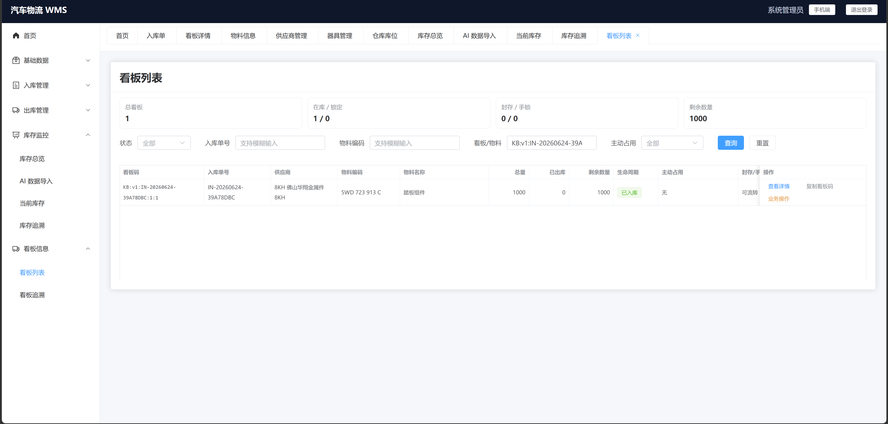

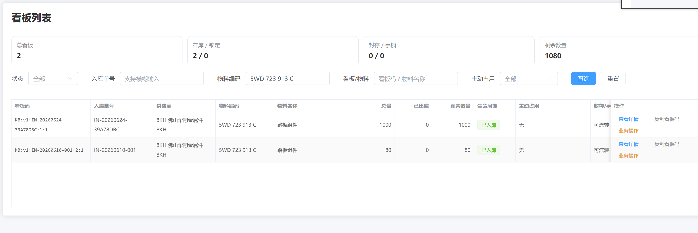

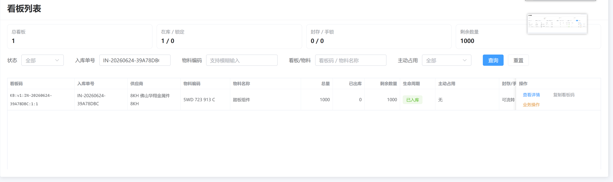

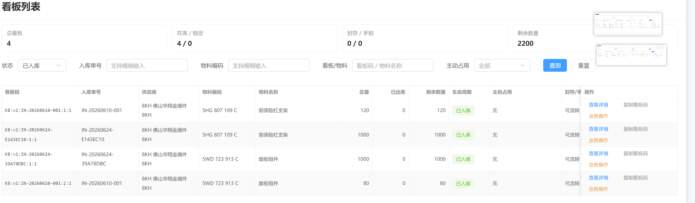

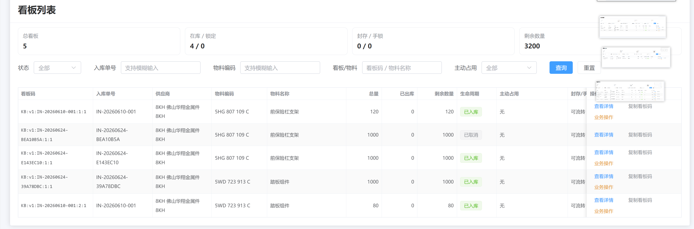

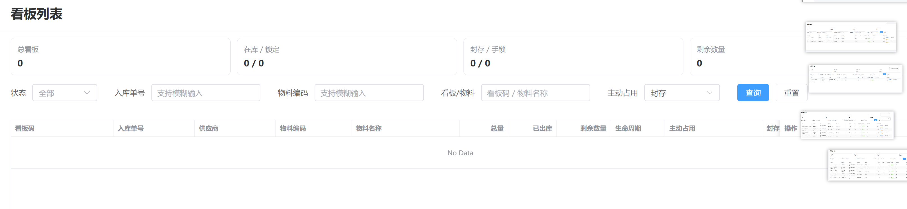

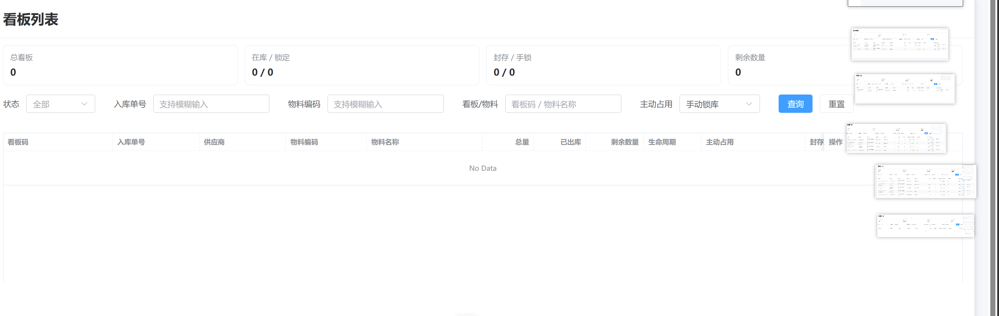

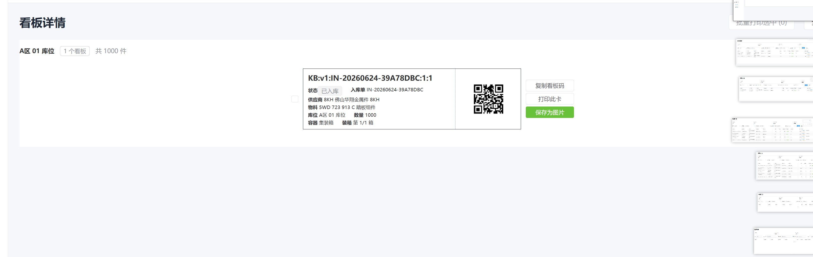

## FR-08 表格批量导入

```text
FR 编号：FR-08
验收人：用户验收，姓名待补
验收时间：2026-06-24 18:36 CST
前置数据：验收前确认 `docs/specs/2026-06-23-wms-completion-requirements.md` 中 FR-08 是独立的“表格批量导入”需求；批量导入数据不是 AI 功能，AI 联动功能应作为基于现有数据的智能推荐/风险预警独立需求验收。
操作步骤：未继续执行 CSV 上传、导入摘要、错误行反馈和批次明细查询；验收在需求口径检查阶段中止。
预期结果：见 week4-fr-acceptance-test-steps.md#fr-08-表格批量导入
实际结果：当前交付物/页面口径将表格批量导入与 AI 样例数据准备或 AI 预警联动耦合，验收对象与 FR-08 独立表格导入需求不一致；因此本轮跳过 FR-08 功能细节验收，不对导入成功率、错误反馈和明细查询作通过性判定。
结论：跳过验收，待返工后重验
遗留问题：需要先拆清 FR-08 与 FR-09：FR-08 只验收表格批量导入能力；FR-09 再验收基于现有数据的智能推荐/风险预警能力。返工后重新执行 FR-08 的导入成功、错误反馈、导入摘要、批次和明细查询验收。
截图或日志：无；本轮因验收对象口径不成立而跳过。
```

## FR-09 AI 预警准备

```text
FR 编号：FR-09
验收人：用户验收，姓名待补
验收时间：2026-06-24 18:52 CST
前置数据：验收前确认 FR-09 应作为独立 AI 联动功能，基于现有 WMS 数据进行智能推荐/风险预警；它不等同于 FR-08 表格批量导入，也不应以批量导入本身作为 AI 功能验收对象。
操作步骤：未继续执行风险样例、触发原因、数据不足降级提示和 AI 边界声明的页面验收；验收在需求实现口径检查阶段中止。
预期结果：见 week4-fr-acceptance-test-steps.md#fr-09-ai-预警准备
实际结果：由于需求实现出现偏差，当前交付物未能形成符合 FR-09 的独立智能推荐/风险预警验收对象；无法继续验证缺货风险样例、呆滞风险样例、触发原因、可解释规则、数据不足降级提示，以及未将外部市场、突发事件、AI 仓库管理员或真实模型训练包装成本周已完成功能的边界声明。
结论：跳过验收，待返工后重验
遗留问题：需要先修正 FR-09 实现边界：AI 预警应读取现有业务数据或导入后的业务数据，输出可解释的智能推荐/风险预警；FR-08 仅负责独立表格导入能力。返工后重新执行 FR-09 的风险样例、触发原因、降级提示和真实模型边界验收。
截图或日志：无；本轮因验收对象口径不成立而跳过。
```
